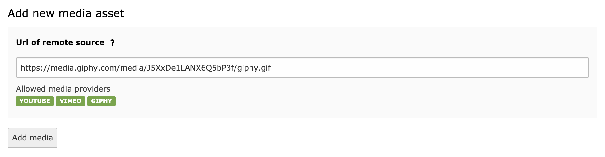
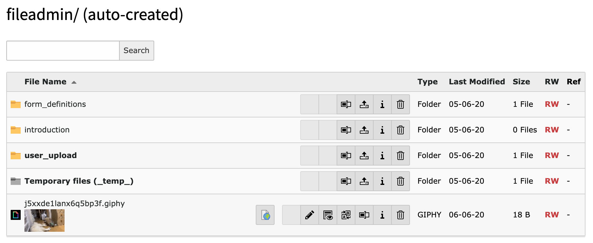
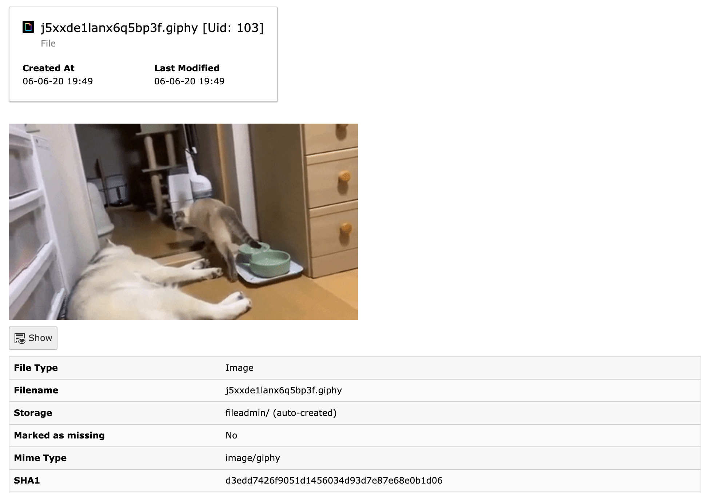

.. ==================================================
.. FOR YOUR INFORMATION
.. --------------------------------------------------
.. -*- coding: utf-8 -*- with BOM.

.. include:: ../Includes.txt

.. _user-manual:

Users Manual
============

Target group: **Editors/Users**

Add media assets in your fileadmin and add assets to text media elements.

   Add new asset

   File list

   File info

.. figure:: ../Images/UserManual/plugin-add-reference.png
   :class: with-shadow
   :alt: Plugin add reference
   :width: 300px

   Plugin add reference
